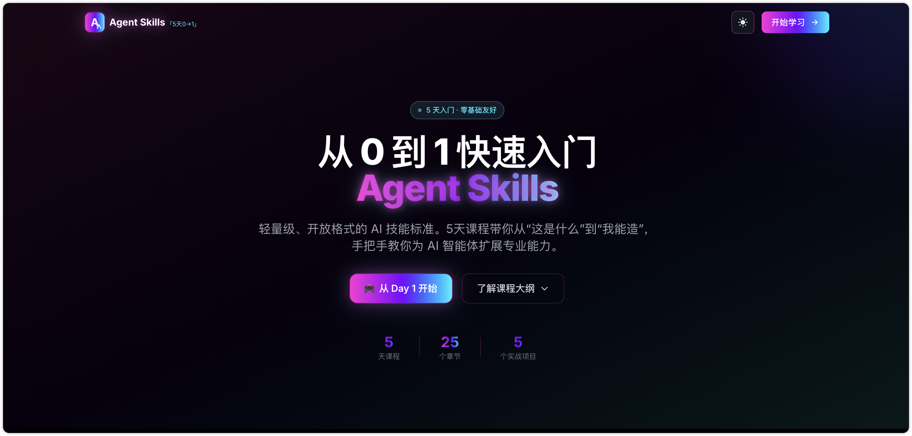
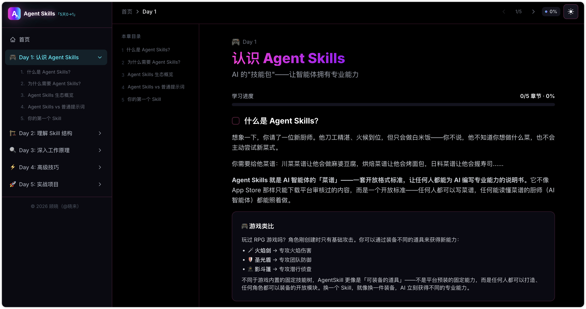
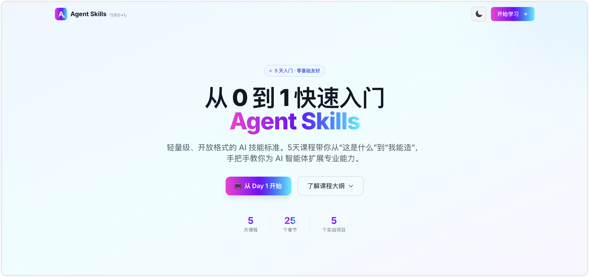
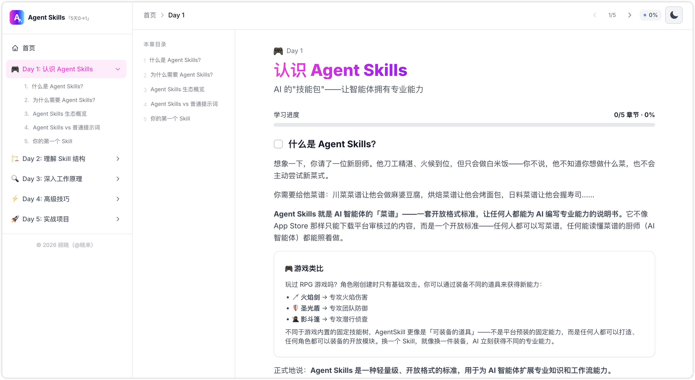
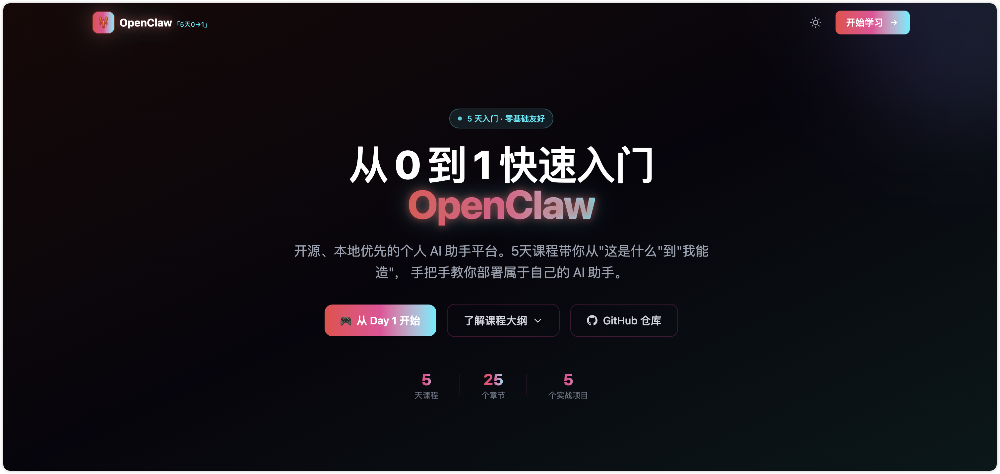
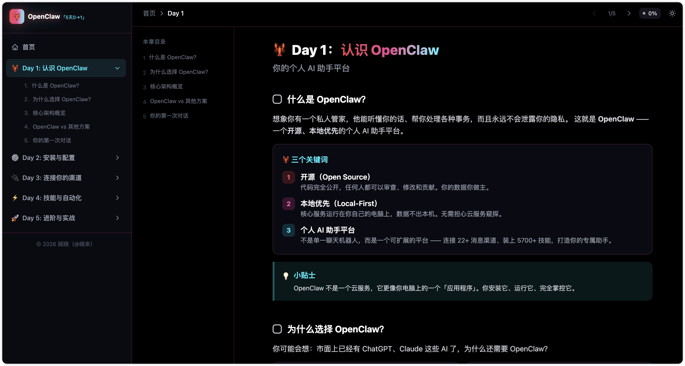
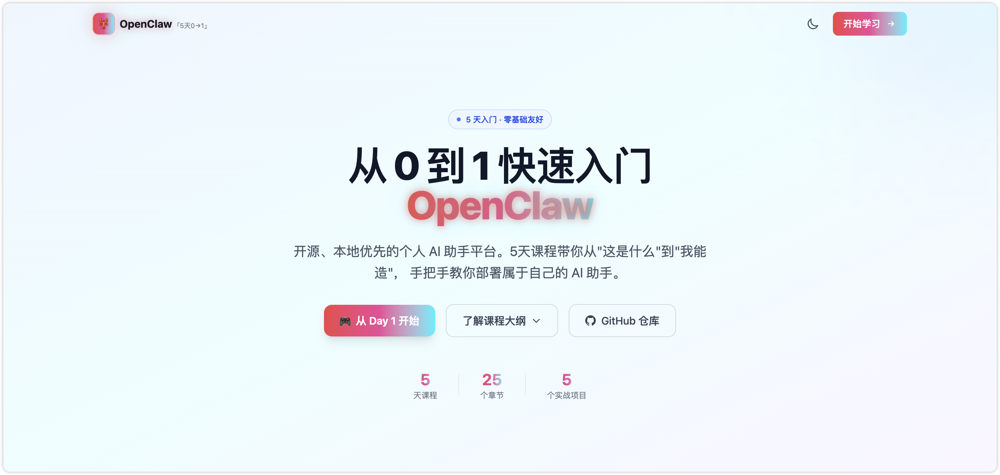
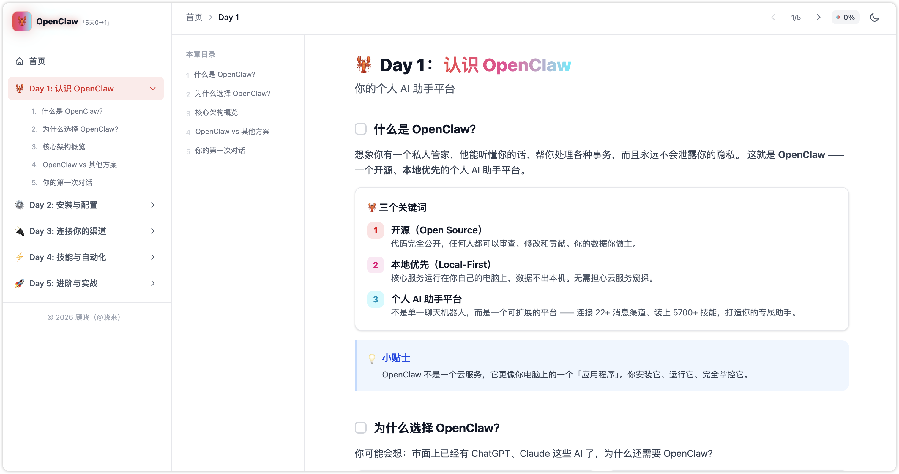

# 📘《图解Agent Skills：扣子与OpenClaw“龙虾”实战》配套资源仓库


### 🗂️仓库目录结构

```markdown
agent-skills-book/
     |----- assets/
     |----- docs/
     |----- images/
     |----- skills/
     |----- reference.md
     |----- README.md
```

### 📜目录文件说明

- assets：书中涉及到的代码和提示词
- docs：书中涉及到的实操教程更新以及拓展教程
- images：常规图片资源
- skills：书中涉及到的技能（Skills）
- reference.md：书中涉及到软件及工具来源，更多可参考的学习渠道
- README.md：说明


## 🔖书籍目录

#### 第1章 技能的起源与行业背景
##### 1.1 技术起源：从工具使用到能力封装的演进
##### 1.2 行业背景：AI Agent发展的必然需求
##### 1.3 关键阶段与核心价值定位

#### 第2章 初识技能
##### 2.1 技能是什么
##### 2.2 Skills基础架构
##### 2.3 技能的工作机制
##### 2.4 技能的核心优势

#### 第3章 快速上手，从使用现成技能开始
##### 3.1 搭建使用环境和安装配置工具
##### 3.2 技能使用实操
##### 3.3 推荐使用的几个技能

#### 第4章 实战进阶，开发构建你自己的技能
##### 4.1 如何设计一个好用且可维护的技能
##### 4.2 开发工具选型与实操案例

#### 第5章 扣子技能使用实践与典型案例
##### 5.1 扣子：最容易上手的打开方式
##### 5.2 基础流程：从0到1构建技能全流程
##### 5.3 学习场景：打造“小学文言文全能学习助手”技能
##### 5.4 办公场景：从重复事务到智能协同
##### 5.5 自媒体创作场景：儿童睡前故事技能
##### 5.6 生活服务场景：AI赋能长期目标管理

#### 第6章 OpenClaw快速实践指南
##### 6.1 OpenClaw是什么
##### 6.2 部署方案对比，选择适合你自己的方式
##### 6.3 基于扣子，一键极简部署搭建
##### 6.4 基于公有云部署，搭建一个7x24小时服务的AI智能助理
##### 6.5 OpenClaw技能安装、使用与删除
##### 6.6 多场景实战案例
##### 6.7 多Agent协同：基于多飞书机器人，打造你的AI团队

#### 第7章 技能核心价值、风险防范与未来
##### 7.1 技能核心价值再认识
##### 7.2 成熟使用技能需要理解的边界与约束
##### 7.3 从掌握技能到构建自己的能力体系
##### 7.4 AI时代的能力重塑与未来机遇


## 网站指南

### Agent Skills 5 天快速入门指南

#### 在线访问

☛ https://agentskills.guide101.top

##### 暗黑主题



###### 预览



##### 亮色主题



###### 预览



### OpenClaw 5 天快速入门指南

#### 在线访问

☛ https://openclaw.guide101.top

##### 暗黑主题



###### 预览



##### 亮色主题



###### 预览



---

> 注：本仓库也会在一段时间内保持一定的更新，祝您学习愉快！