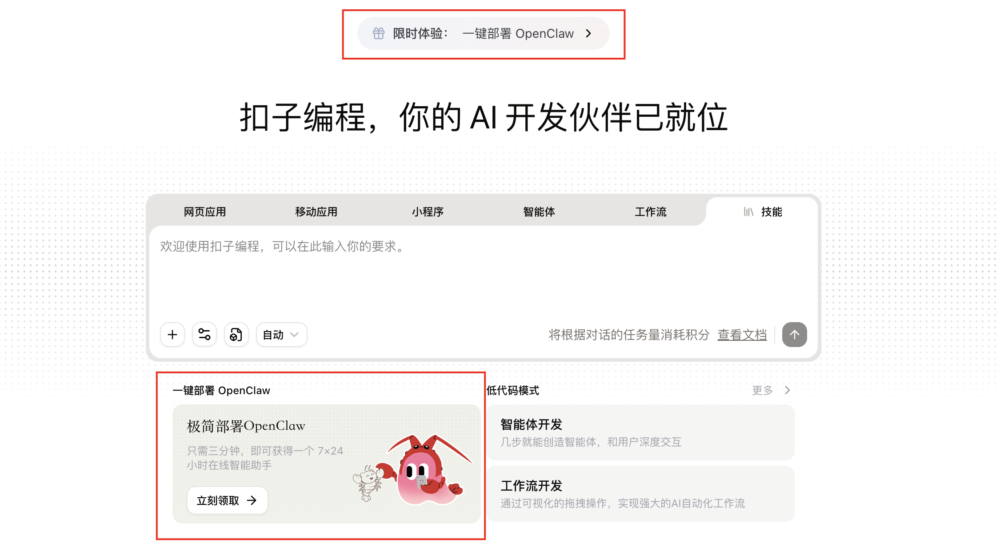
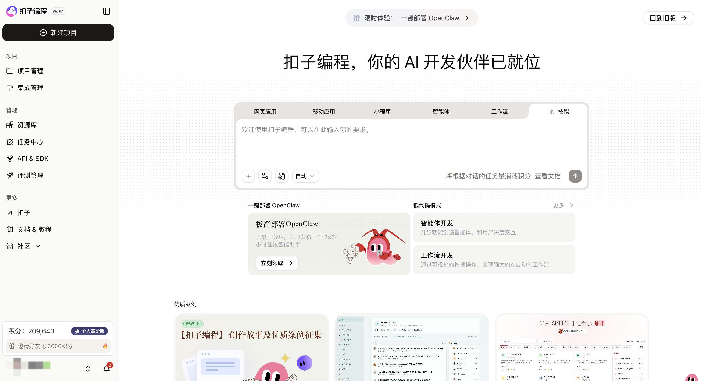
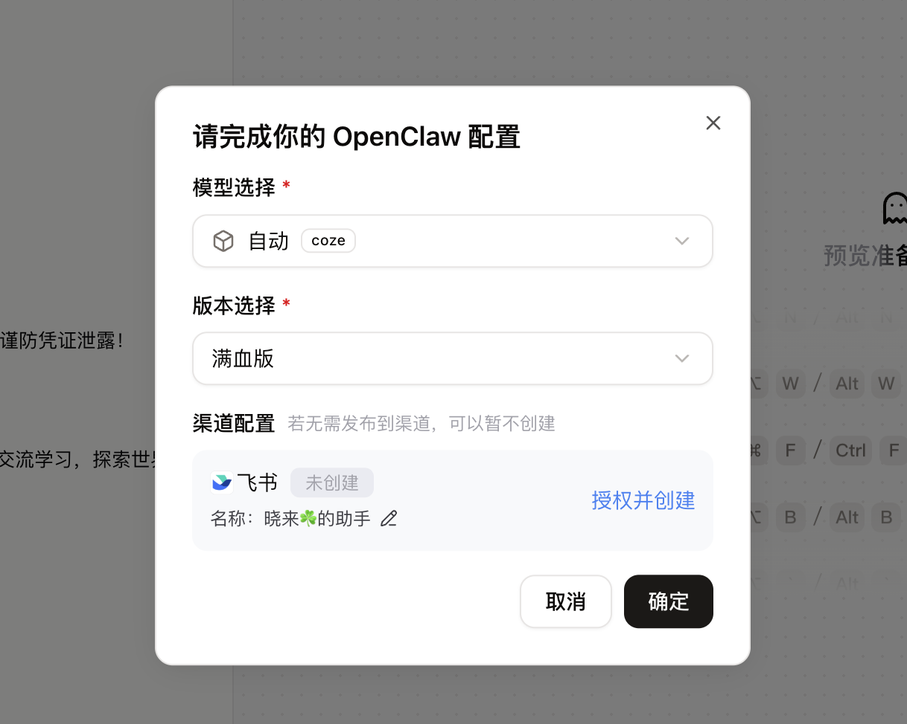
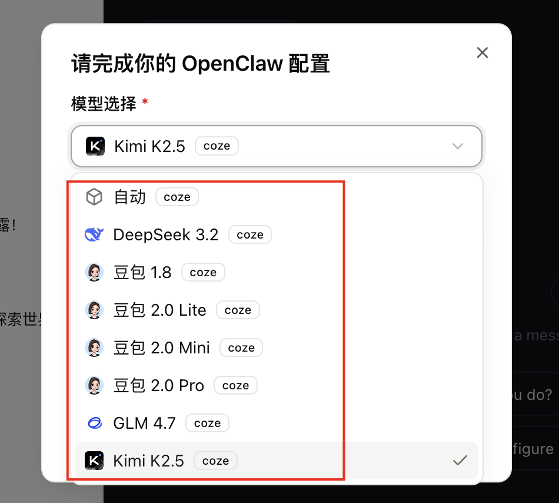
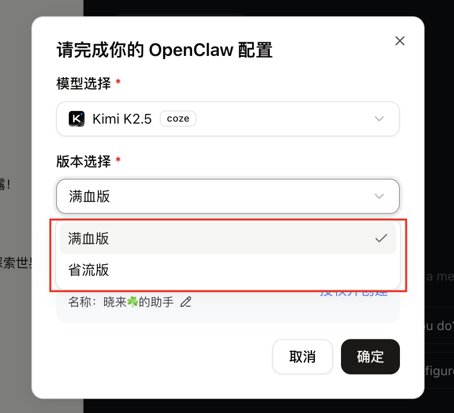
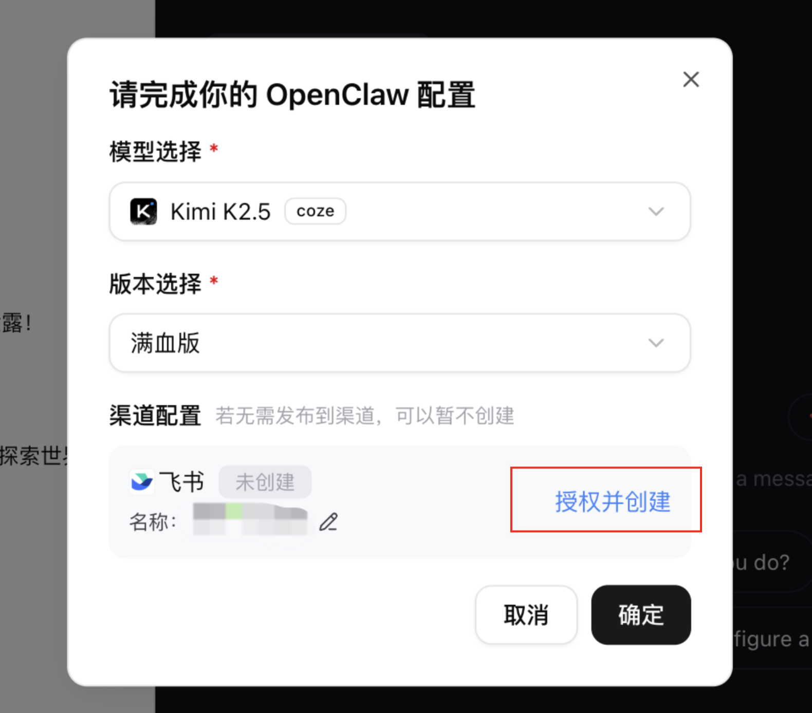
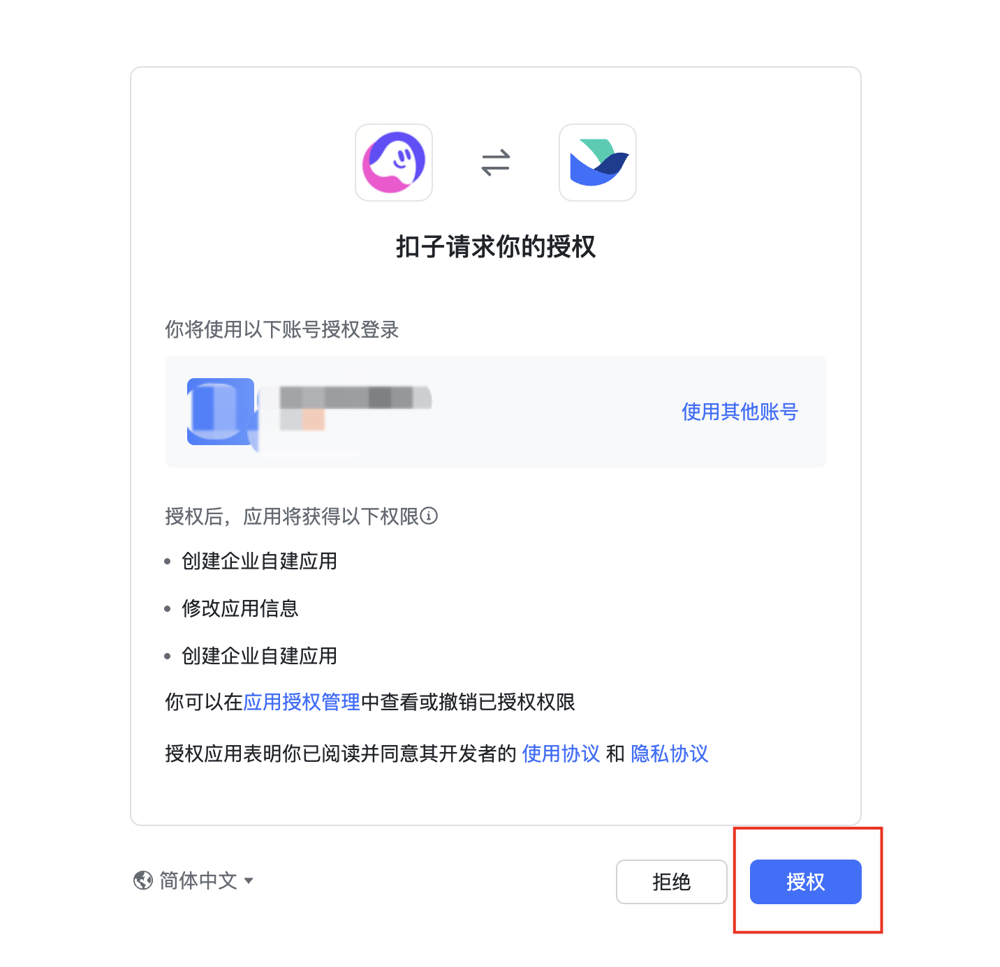
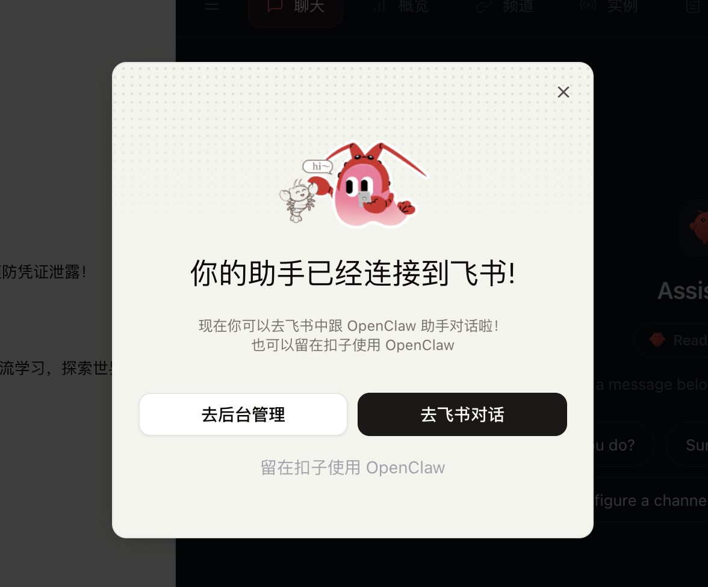
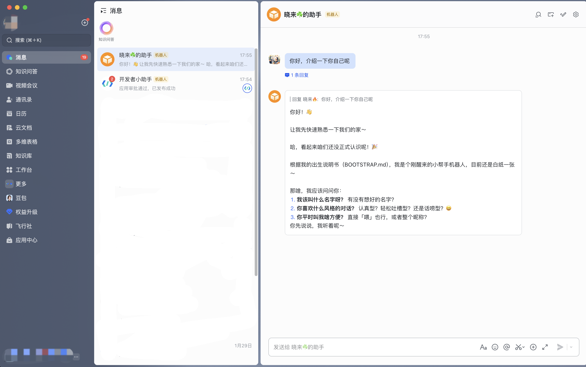
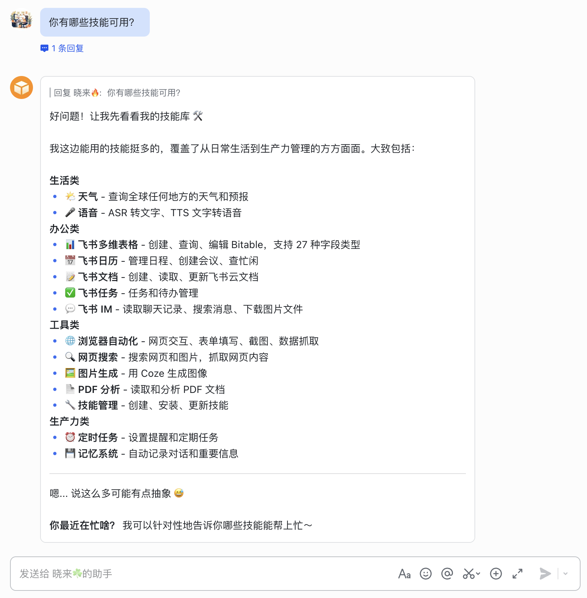

# 基于扣子，一键极简部署搭建OpenClaw（更新版）

扣子（Coze） 一键部署 OpenClaw 的方式又更新了。
之前，扣子（Coze） 虽然提供了一键部署 OpenClaw 的方式，但是要接入飞书聊天渠道，还是需要手动去创建应用、添加机器人，再配置权限、回调事件等。
现在一键部署功能升级，免去了繁琐的配置操作，一键接入飞书，直达对话。
在扣子官方平台「扣子编程」的首页，提供了两个「一键部署」的入口，你可以点击上方的「一键部署 OpenClaw」链接按钮，也可以点击「极简部署OpenClaw」卡片的「立刻领取」前往部署。

扣子编程官网：https://code.coze.cn/。
打开官网，整体是这个样子：

点击「立刻领取」按钮，弹出部署对话框。

### 第一步，选择模型
扣子提供了多款模型供我们选择，如 DeepSeek、GLM、Kimi，以及多个型号的豆包模型，按需选择一个就好。

GLM 和 Kimi 在当下相对用的多一些，可试试。

### 第二步，选择版本
扣子提供了两个版本配置可以选择，满血版和省流版。
这里，我们无疑选择满血版，尽可能以最大化体验功能为主。

### 第三步，授权飞书
点击「授权并创建」按钮，前往飞书授权页面。

在弹出的授权确认页，点击「授权」按钮，完成飞书对扣子的授权。

随后回到对话框，等个几十秒钟，完成与飞书的连接，整个部署过程就搞定了。

点击「去飞书对话」按钮，直达飞书客户端对话界面，真正「一键部署」体验。

全流程下来不到 3 分钟搞定，不需要其他繁琐操作。
如果你还没有飞书账号，跟着提示用手机号登录注册一个就好了，没有任何难度。
当一切部署配置搞定之后，你就可以随心所欲地去“养虾”了。

以上就是扣子更新版部署 OpenClaw 的方式。