# 基于腾讯云部署OpenClaw，搭建7x24小时服务的AI智能助理（更新版）

国内主流的公有云都提供了快捷部署的方式，如腾讯云、阿里云、火山引擎、百度智能云等。

这里我们以腾讯云作为部署的平台进行演示，在部署之后，接入飞书通道的方式相较于之前，有了进一步的简化；之前需要手动配置权限、配置事件回调等操作，现在只需要一键授权即可。

接下来我将演示具体流程。

### 一、服务器选购

腾讯云官网链接：https://cloud.tencent.com/act/pro/openclaw

在腾讯云官网平台，按需选购一台合适的服务器：

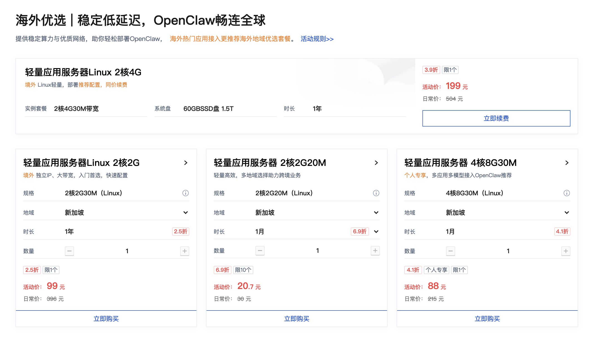

在初期更多是试验场景的情况下，我们可以基于节约成本的原则，投入最少的经济成本，采购最便宜的即可。

如果你还没有账号，需要先注册，并且到控制台账号中心对账号进行实名认证。

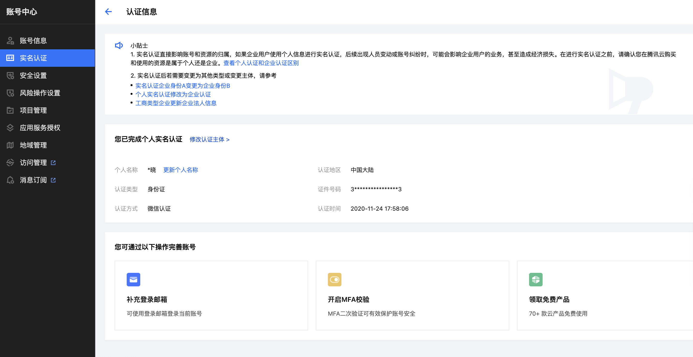

之后再回到采购页，单击所需套餐的“立即购买”按钮，前往配置选择页面。地域可选择离国内相对较近的节点，镜像选择OpenClaw，时长按需即可。

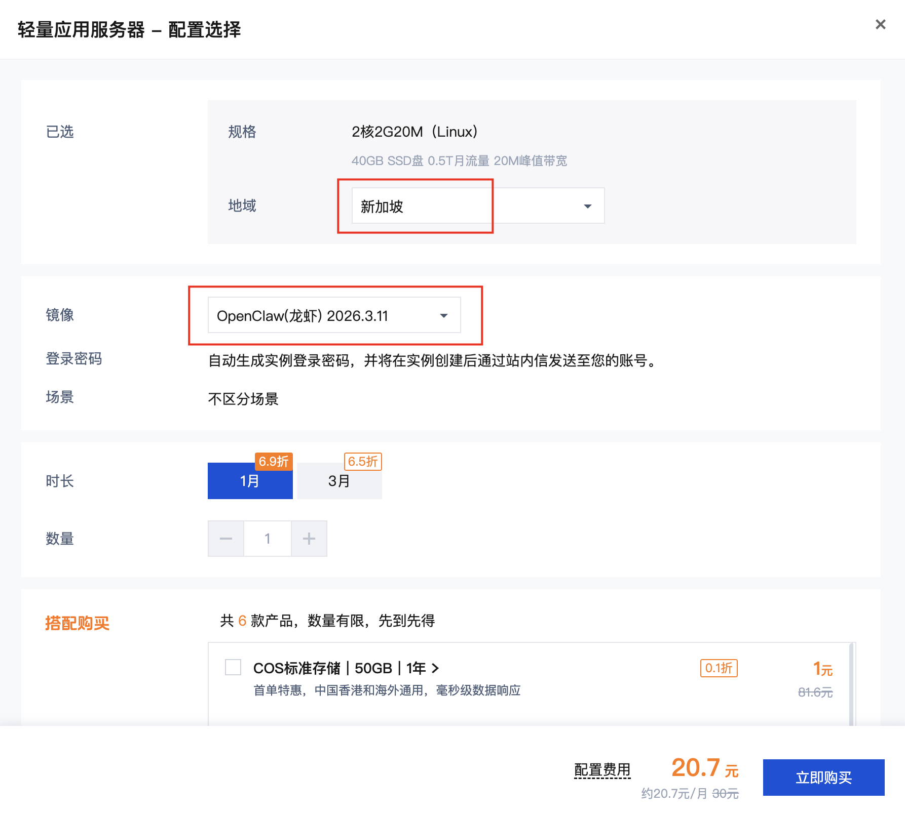

购买之后，查看实例，系统会分配服务器实例，就会得到一个带有OpenClaw镜像标识的轻量级服务器卡片。

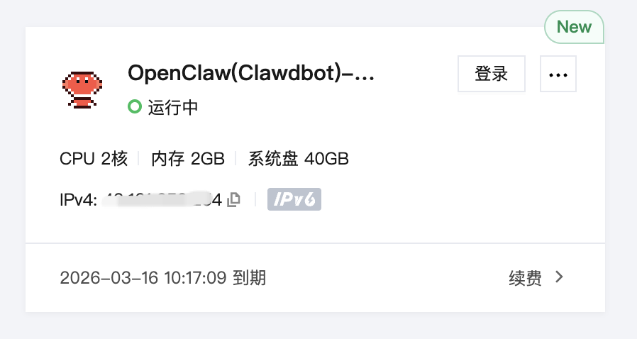

单击卡片进入管理实例界面，单击“应用管理”选项卡，进入OpenClaw配置页，进行模型、通道以及技能配置等，这里主要先配置模型和通道。

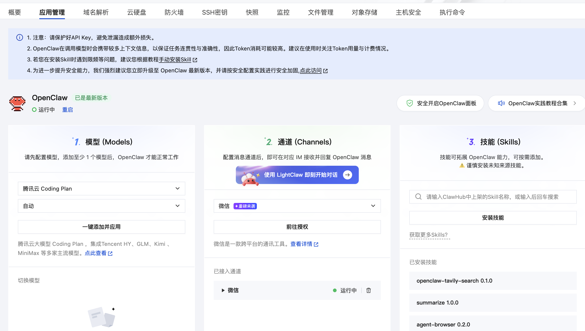

### 二、配置模型

对于模型，OpenClaw官方推荐使用Kimi2.5，也是当下对OpenClaw适配比较好的模型。我们这里即选择Kimi2.5模型作做演示。

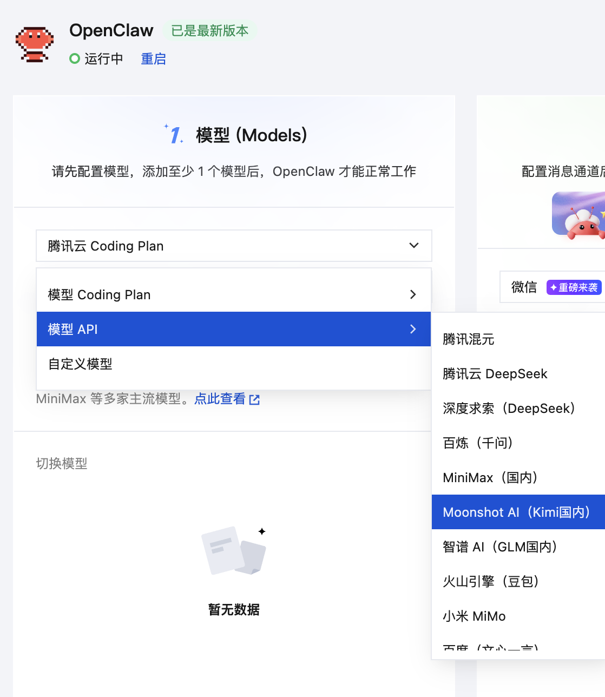

依次选择“Moonshot AI（Kimi国内）” ，选择“Kimi K2.5” 版本， 单击“点击获取 API KEY”，前往Kimi的“API KEY管理”页面，创建并复制获取密钥，妥善保存好。

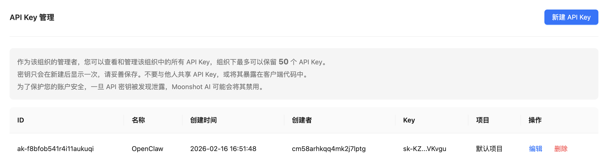

回到“应用管理”选项卡的OpenClaw配置页，在“模型”面板中，继续配置模型，将复制的密钥输入到页面上的密钥框里，并单击“添加并应用”按钮。成功添加后，对应模型状态为“应用中”。

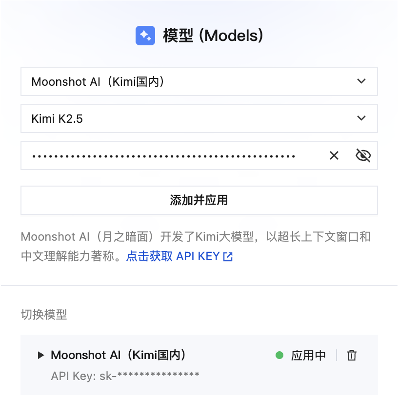

注：在模型被使用之前，需要保证Kimi账户中有一定余额，读者可按需进行充值，避免模型无可消耗额度。

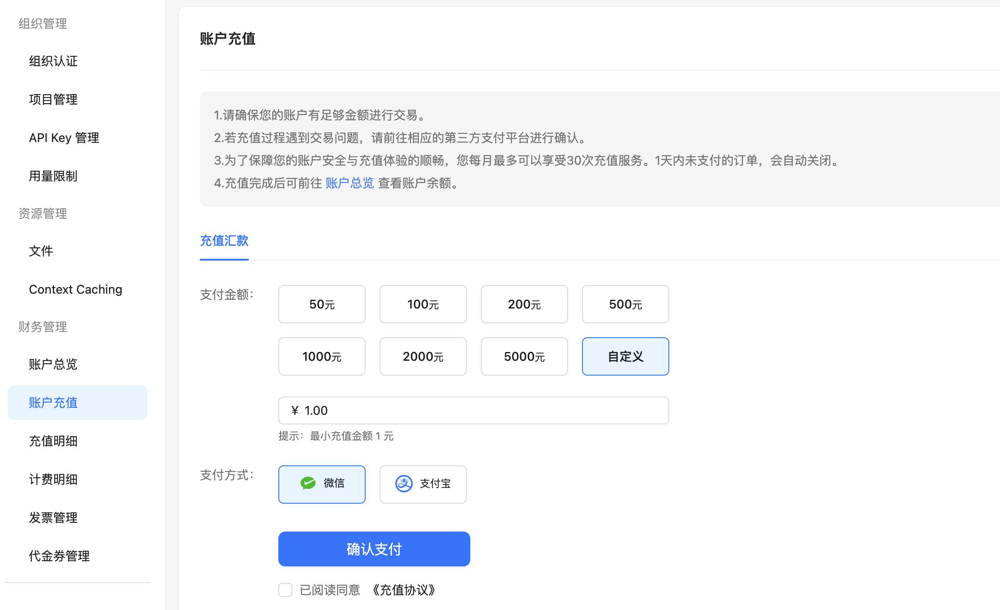

### 三、配置通道

模型已经接入了OpenClaw，接着需要配置通道，也就是与OpenClaw进行交互的入口应用。我们以使用广泛的飞书作为通道，接入到OpenClaw。

在之前，要配置飞书通道，需要通过手动配置的方式；现在腾讯云提供了“快捷配置“的方式，简化了配置流程。

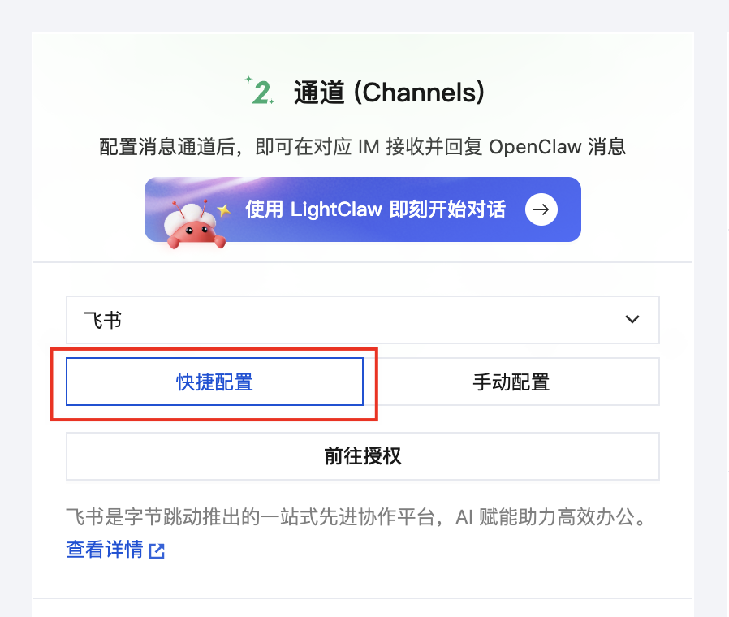

选中「快捷配置」项，单击「前往授权」按钮，弹出二维码。

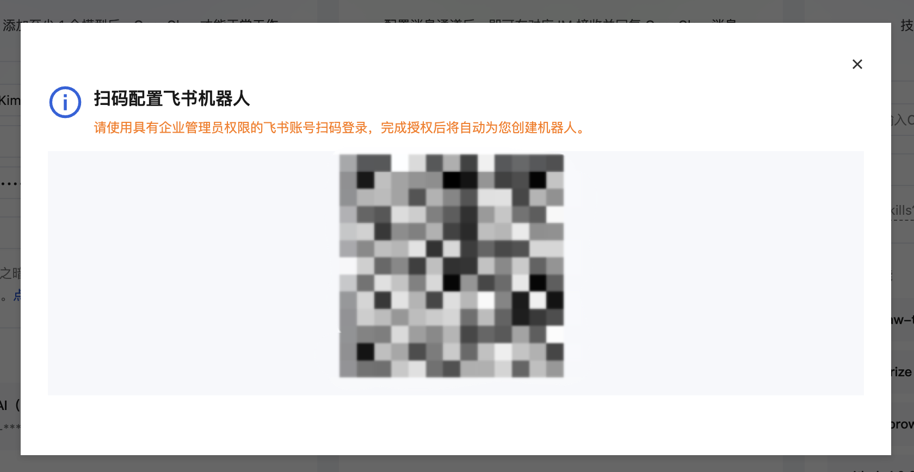

此时，只要用手机版飞书，扫码授权确认，然后等待一会就自动配置好了。

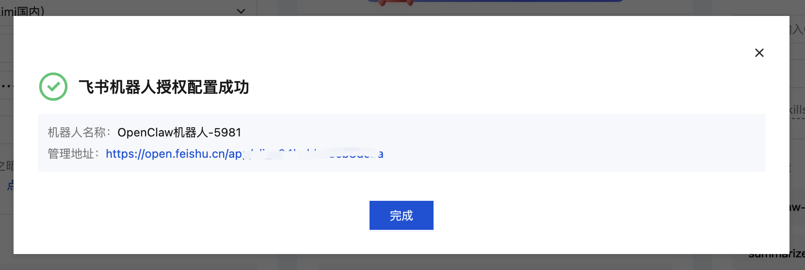

然后，打开飞书客户端，在消息列表中，你就能看到这个飞书机器人了。

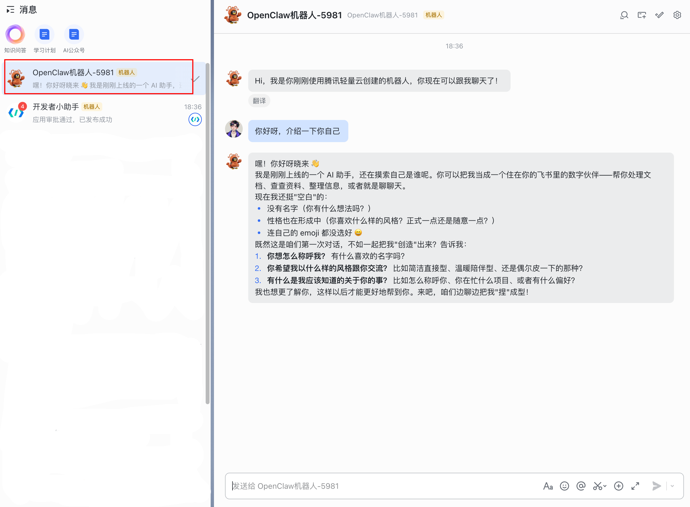

现在接入飞书就是这么简单，比之前要便捷多了。