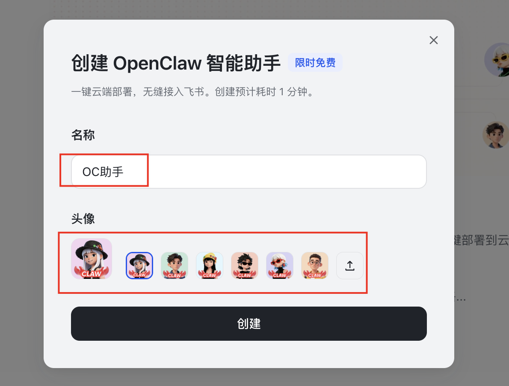
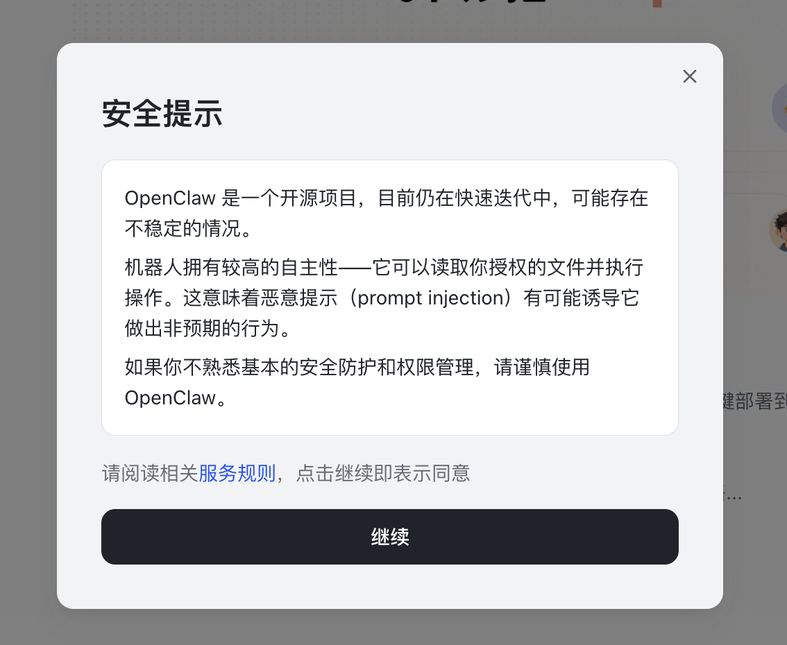
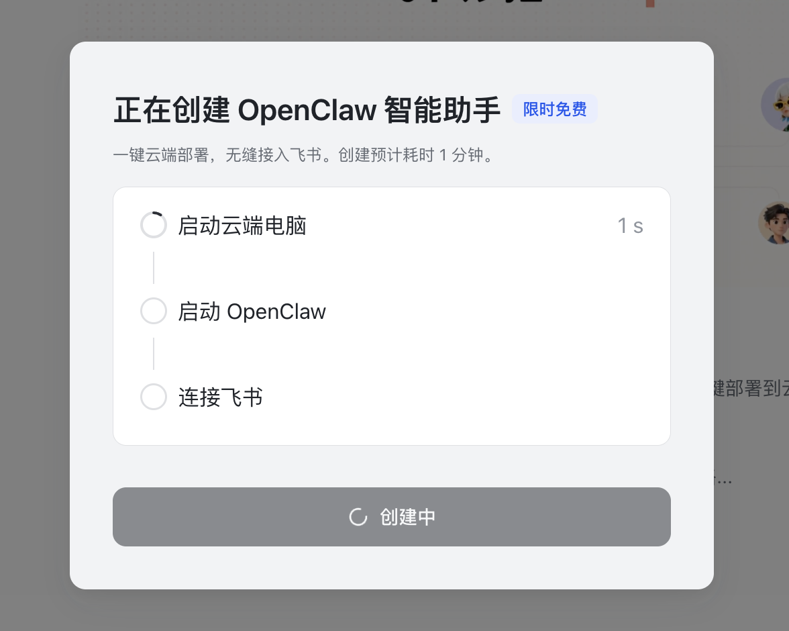

# 飞书妙搭一键部署 OpenClaw

飞书官方平台「妙搭」推出的一键部署，直接将飞书开放平台的所有操作全部打包在一键部署中，真正做到了「一键部署」。
飞书妙搭链接：https://miaoda.feishu.cn/。
进入妙搭首页，右上角有个「一键部署 OpenClaw」 链接按钮，以及下方醒目的「一键部署」图片 banner，都是入口。

点击左侧导航处的「OpenClaw 智能助手」菜单，这里是 OpenClaw 管理页，也是主要入口。

在一键部署之前，如果你还没有登录，或者还没有账号，用手机号登录或者注册一个即可。

之后，点击「创建」按钮，会弹出对话框。

在对话框里输入名称，选择或上传头像，随后点击「创建」按钮。

在弹出的安全提示框中，选择「继续」按钮，进入下一步。

正式执行创建，三个步骤「启动云端电脑」、「启动 OpenClaw」、「连接飞书」依次执行。

全程不到 1 分钟，成功创建并连接到飞书。

点击「管理智能助手」按钮，会进入到 OpenClaw 可视化管理控制台，你可以聊天、查看与管理频道、技能、定时任务等等。

点击「去飞书对话」按钮，则直接跳到飞书客户端的消息对话窗口，省去一切手动配置飞书权限和回调等操作的繁琐步骤。

然后，你就可以在飞书中与 OpenClaw 进行各种对话交互了。