# 微信官方推出龙虾插件ClawBot，微信正式支持接入OpenClaw

就在刚刚不久，微信官方推出「ClawBot」 龙虾插件，正式宣布微信原生支持接入 OpenClaw 了！

这下，再也不用担心使用第三方插件接入微信被封号的情况了。

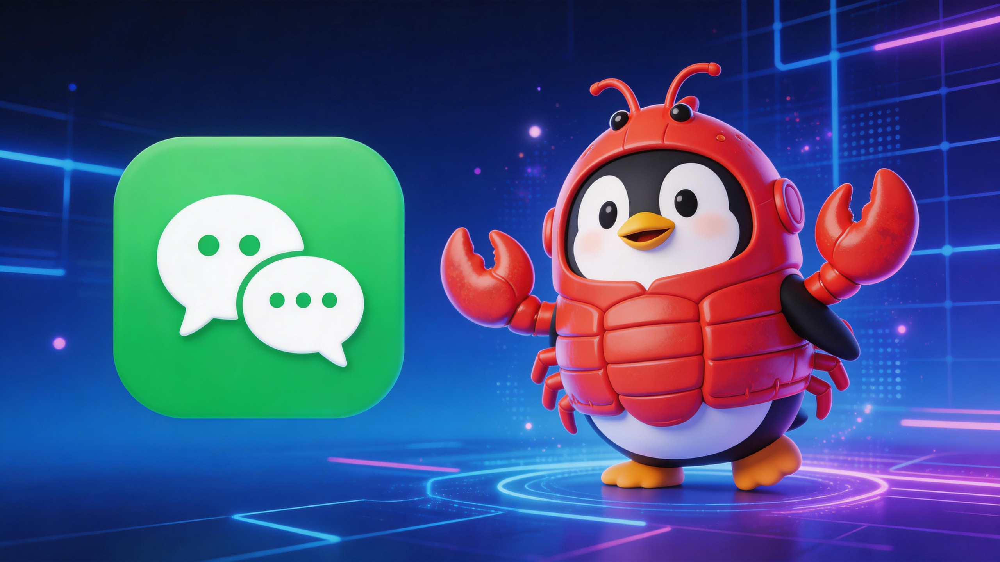

接入的流程非常简单，一行命令，轻松就能接入。

在接入之前，首先需要将微信更新到最新版，有的人说必须更新到 8.0.70 版本，但实际上我单击更新之后，依旧是 8.0.69，同样可以，应该是逐步在推送中。

打开微信，入口：我→设置→插件，已被推送到，你就会看到一个「微信ClawBot」。

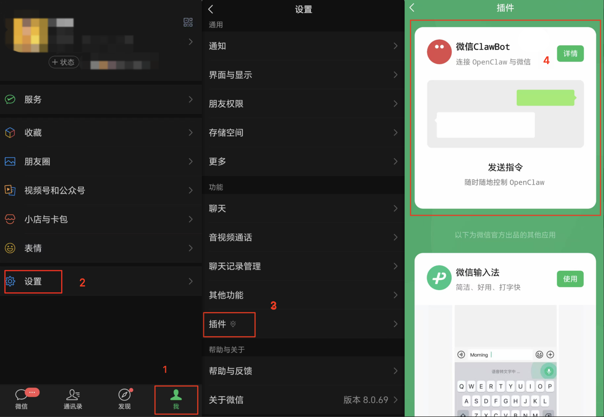

再单击「微信ClawBot」插件上的那个「详情」按钮，进入到说明页。

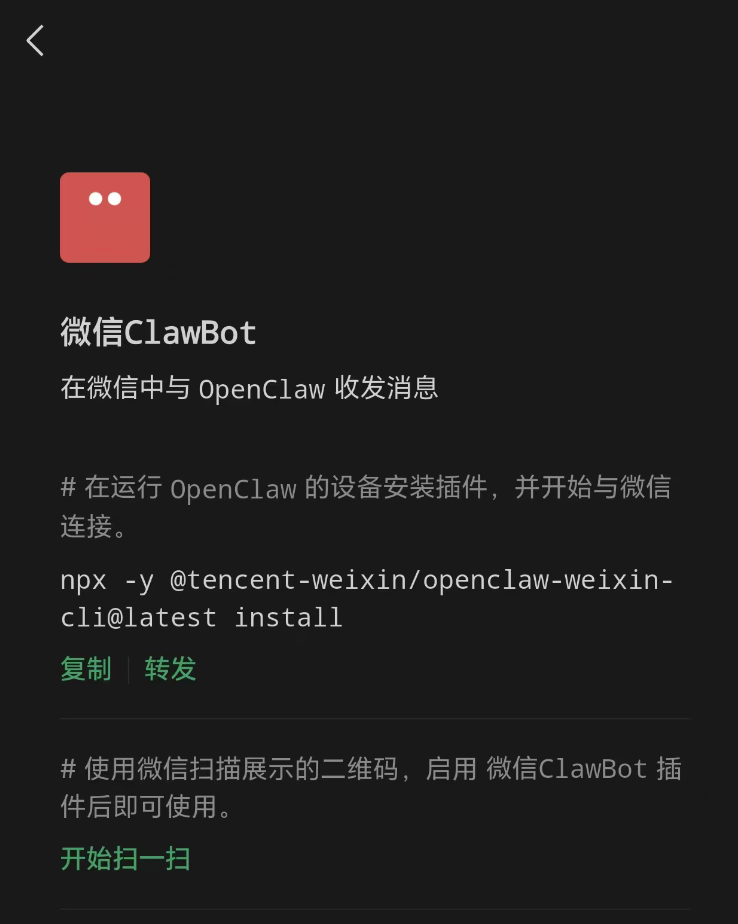

根据说明，只要在运行 OpenClaw 的设备上，不管是本地部署的、还是远程部署的，在终端中输入命令：

```bash
npx -y @tencent-weixin/openclaw-weixin-cli@latest install
```

随后会弹出二维码，等待你使用微信扫码确定。

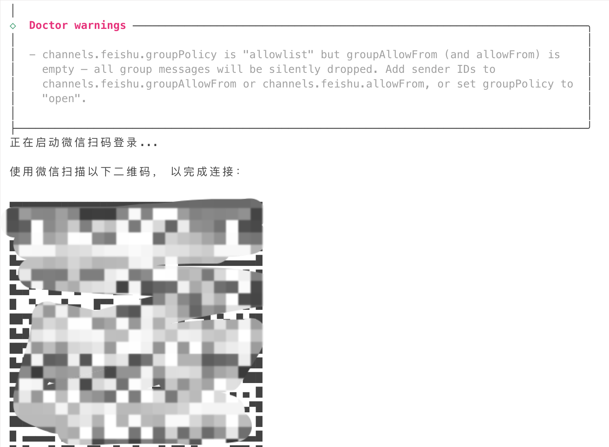

之后，在微信列表中，你会看到一个红色头像的「微信ClawBot」，打开就能与 OpenClaw 对话了。

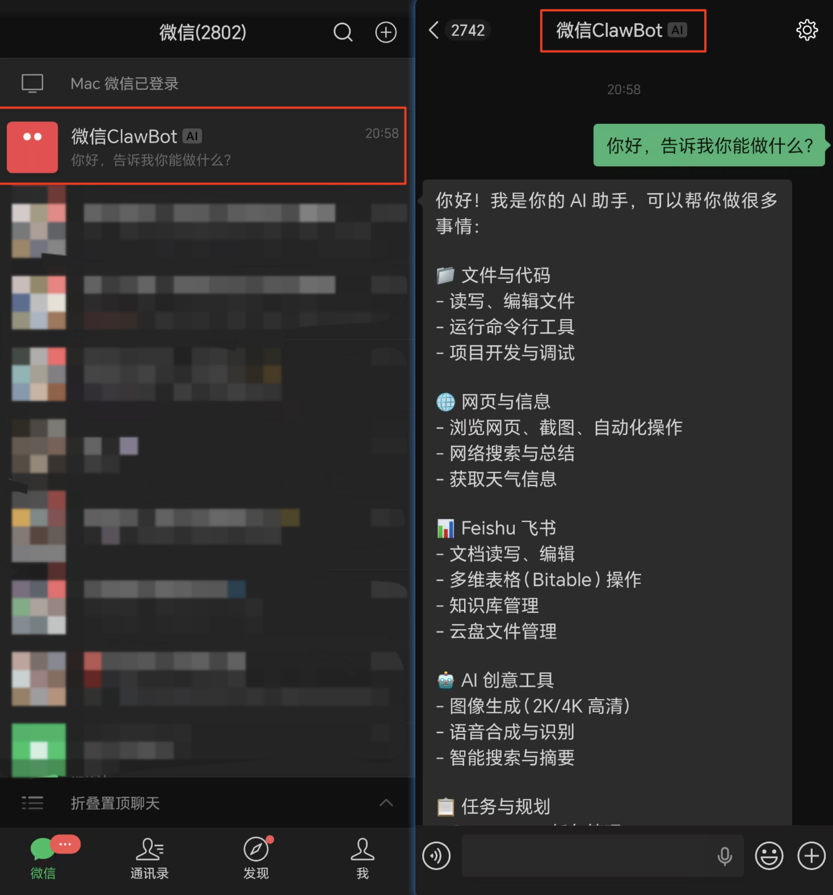

如果你是使用的是腾讯云的轻量级服务器 Lighthouse，配置接入微信就更加简单了。

因为腾讯云 Lighthouse 也第一时间上线了接入微信的通道。

单击类似这样的实例面板，进入到“应用管理”标签页。

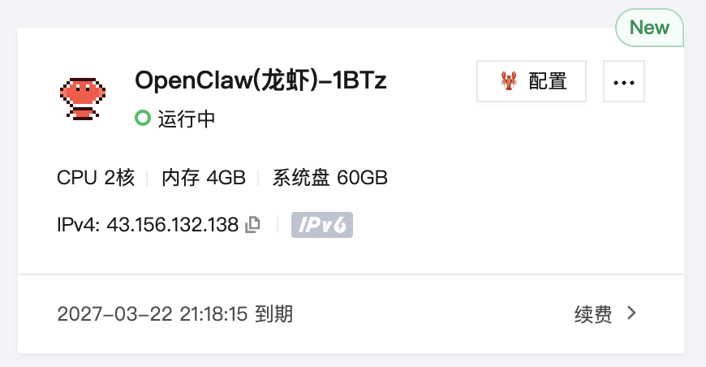

在“应用管理”标签页的中部，你会看到一个“通道（Channels）”面板。

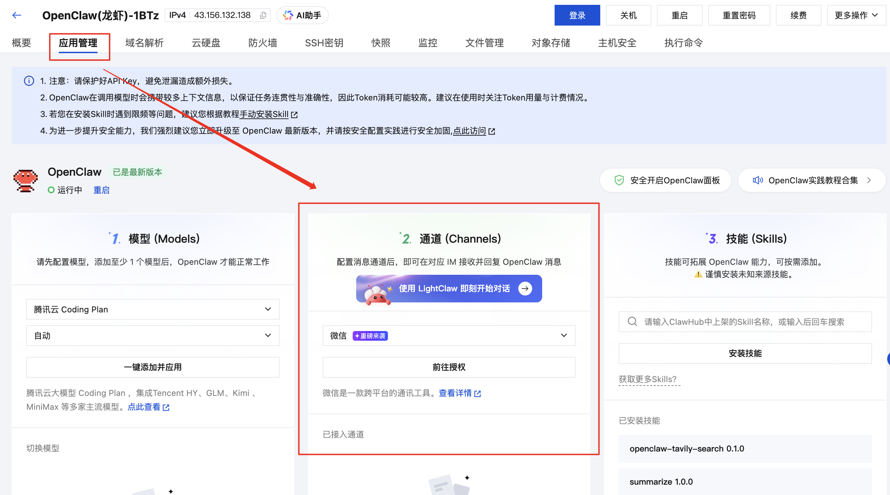

在通道这里，下拉一下，会看到有了一个“微信”选项，这个就是了。

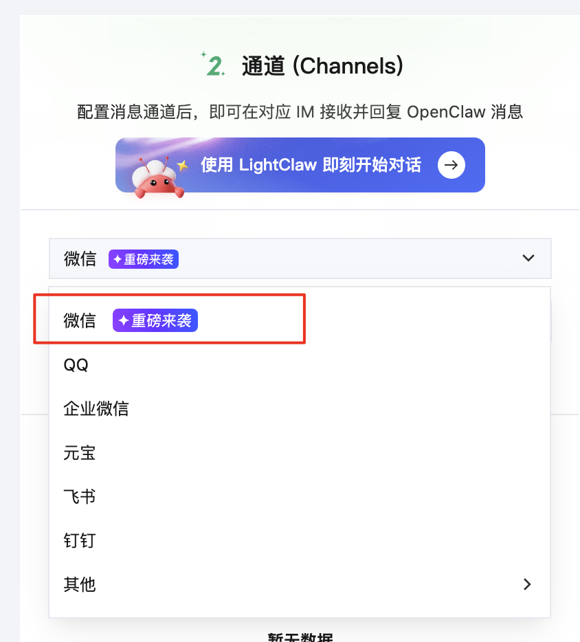

通道选择“微信”，然后单击下面的“前往授权”按钮，会弹出一个二维码。

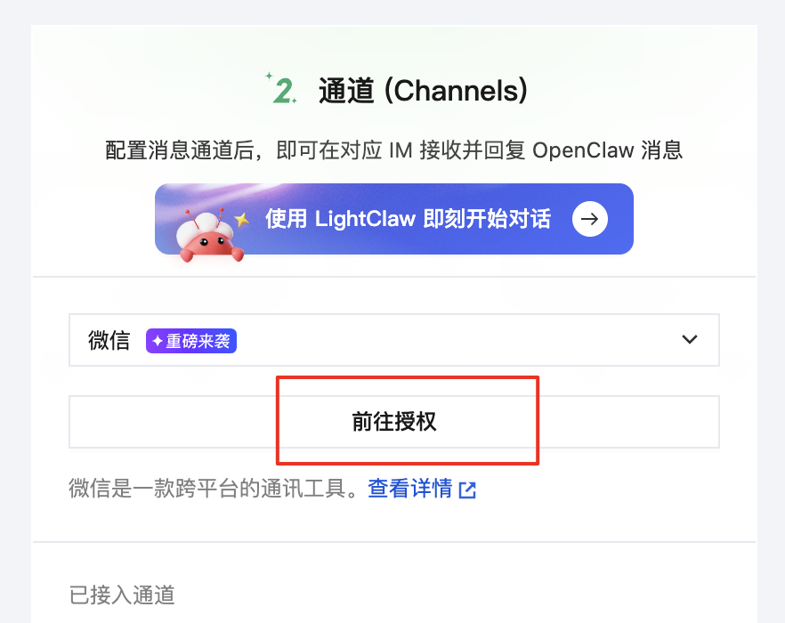

用微信扫描这个二维码，会弹出一个连接确认页。

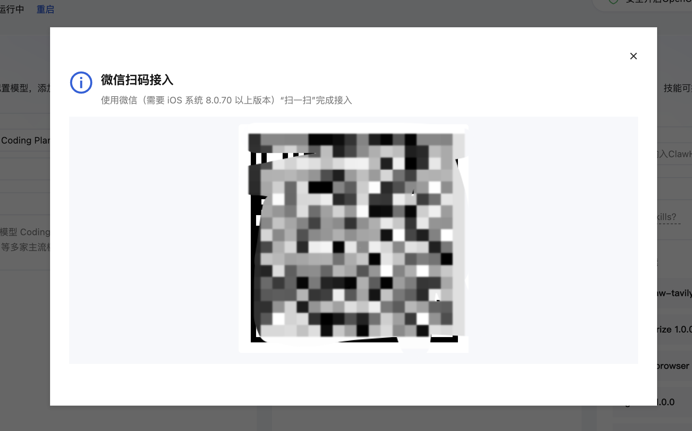

单击这个连接确认页上的“继续连接”按钮，完成接入即可。

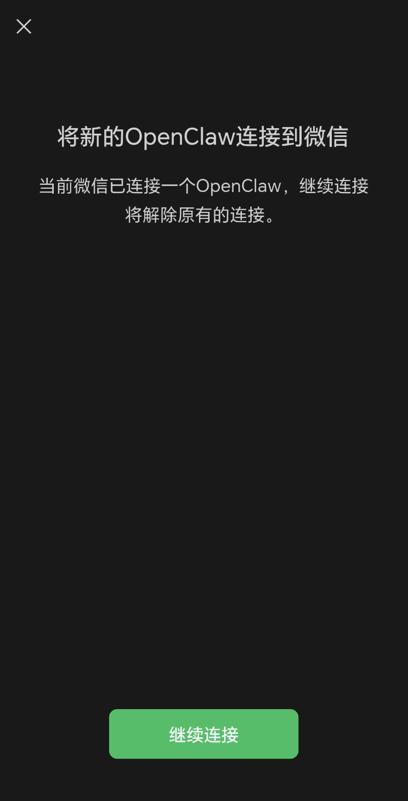

之后就和上面一样，可以对话交流了。

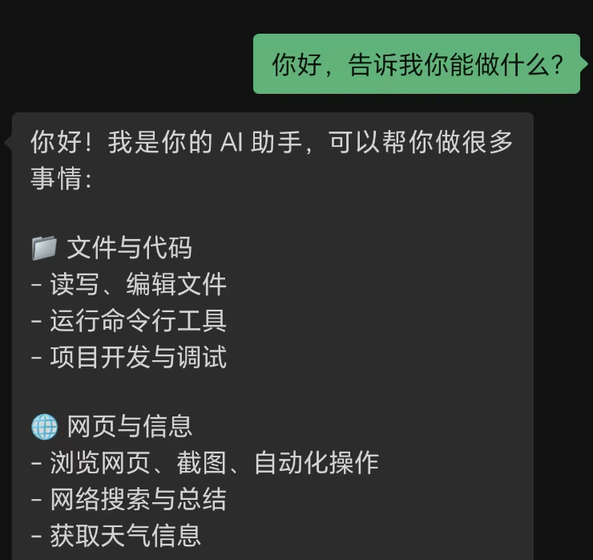

就是这么简单。

再也不用担心被封号啥的了。

微信官方这波操作，真的意义重大，接入 OpenClaw，意味着微信这个国民级的应用，正在往超级 Agent 平台演化，以后不用再切换其他平台了，直接在微信里就能干一个人公司了。

目前只针对于一对一私聊，还不支持群聊，不过这无疑是个好的开始。

相信不久之后，更加丰富的功能就会很快跟进，体验也会越来越好。
