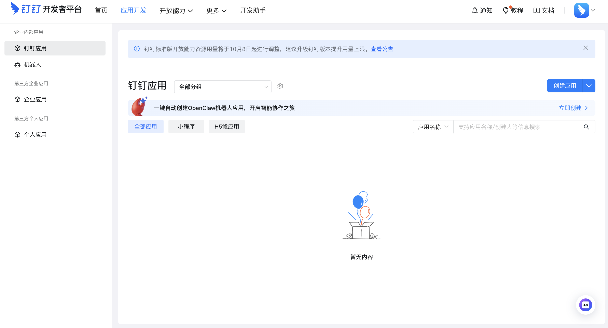
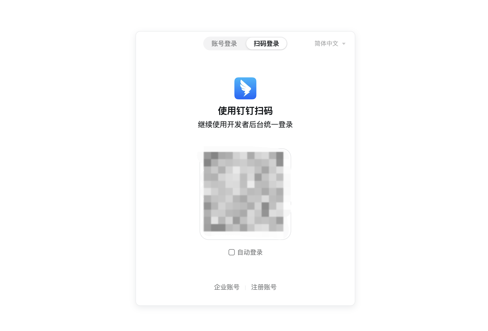
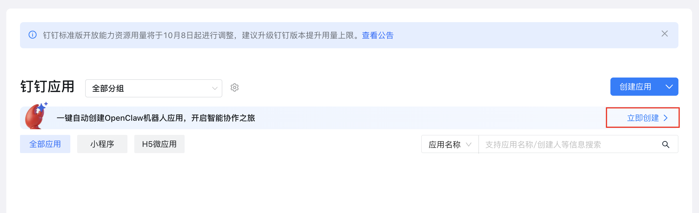
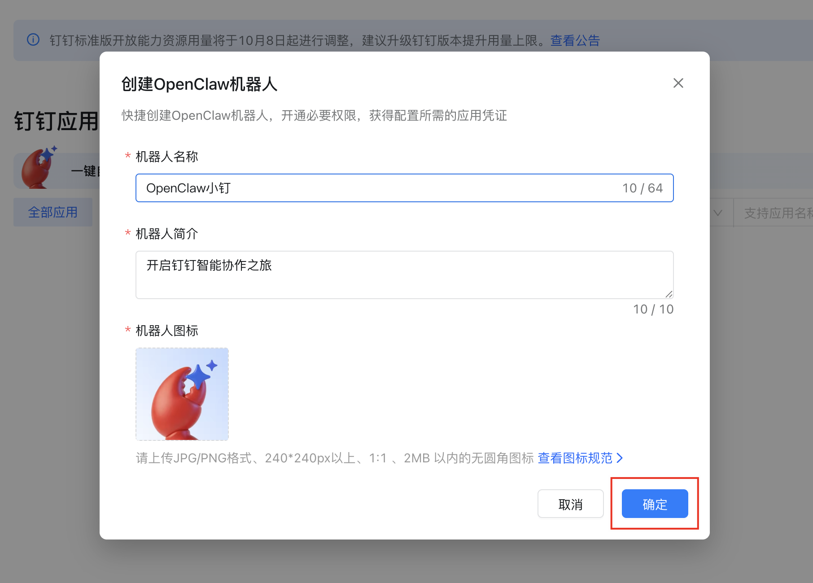
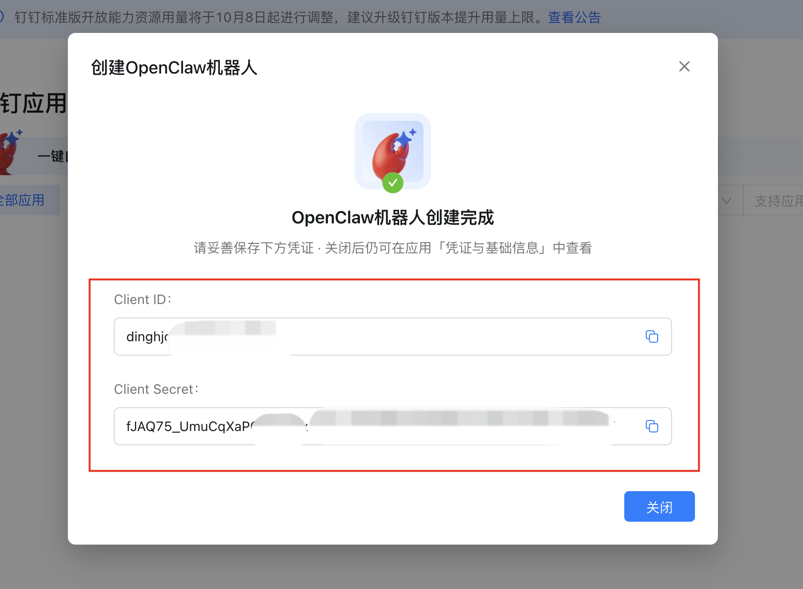
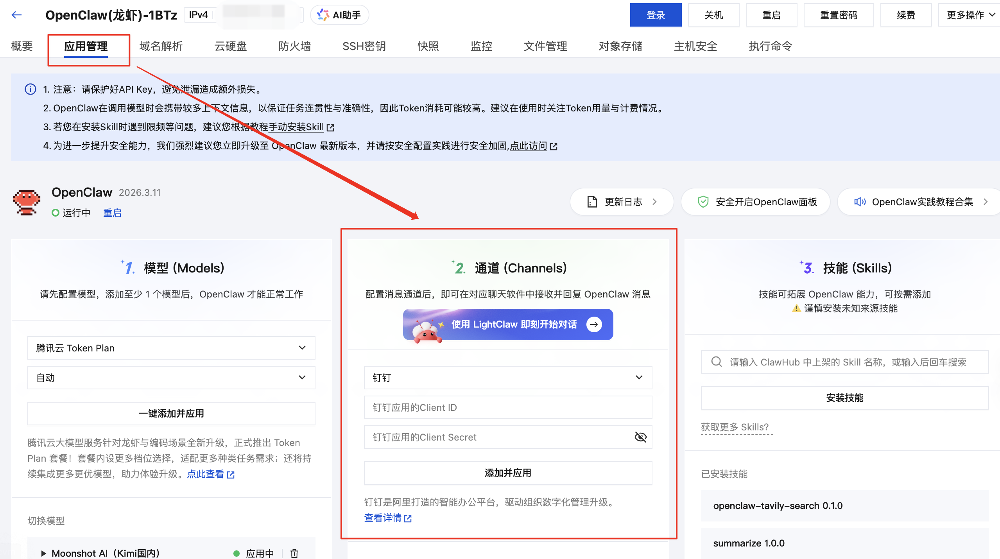
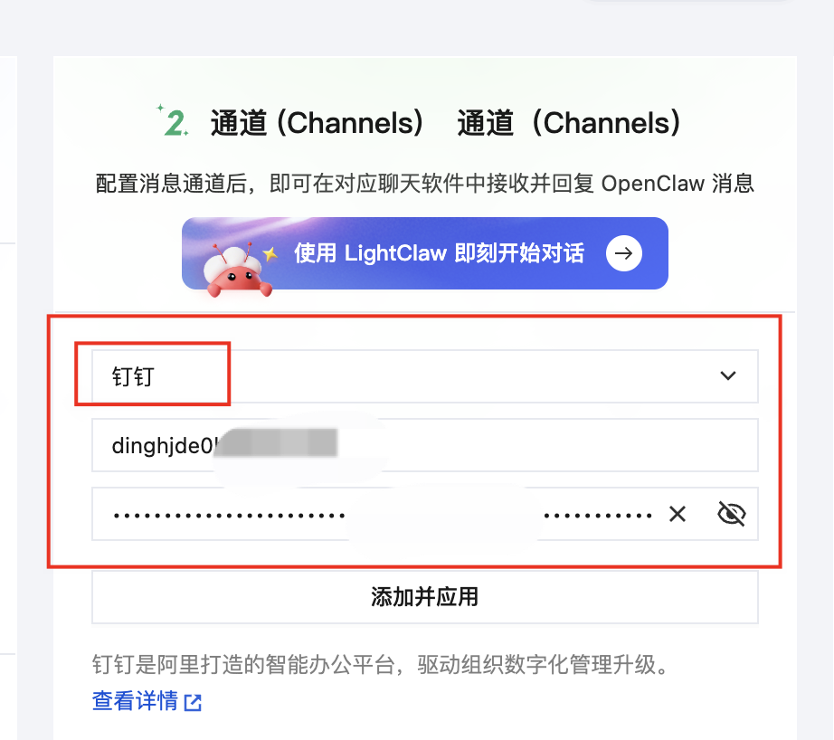
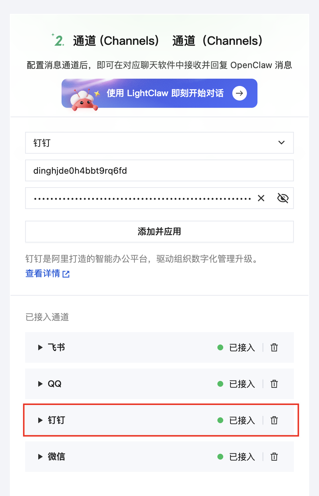
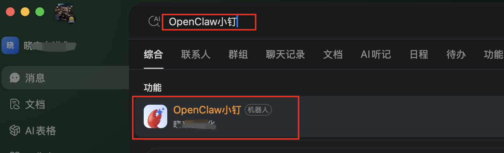
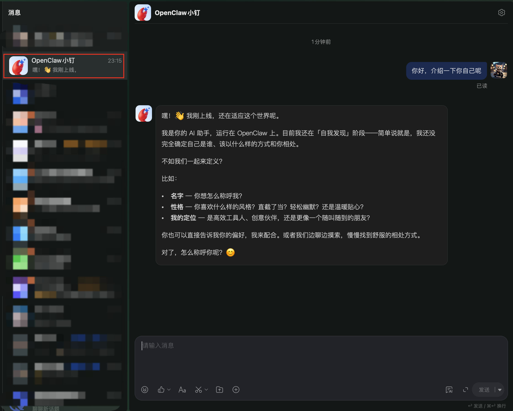

# OpenClaw 接入钉钉教程

在 OpenClaw 中接入钉钉，整个流程与接入飞书很类似。

### 腾讯云 Lighthouse 接入钉钉

首先，我们需要前往钉钉开放平台（ https://open-dev.dingtalk.com/fe/app?hash=%23%2Fcorp%2Fapp#/corp/app ）创建应用。

如果你还没账号，可以根据页面提示，前往注册并登录。

之后，在开发平台，点击页面的上的「立即创建」按钮链接，这个是钉钉专为接入 OpenClaw 提供的快捷创建入口。

在弹出的对话框里，输入机器人的名字、简介和头像，然后点击「确定」按钮。

随后，将创建好的“Client ID”和“Client Secret”保存到备忘录，后面要用到。

登录腾讯云，并进入到 Lighthouse 实例的「应用管理」处。

在「通道（Channel）」面板里，选择「钉钉」，并将上面复制的 Client ID 和 Client Secret 复制到对应输入框中。

点击「添加并应用」按钮，随后在「已接入通道」列表里，看到「钉钉」，表示接入成功。

然后，在钉钉客户端的搜索框中，输入钉钉机器人的名字，点击搜索出来的机器人。

进入对话框中，就能对 OpenClaw 进行交互了。

到此，就完成了钉钉接入到 OpenClaw 了。